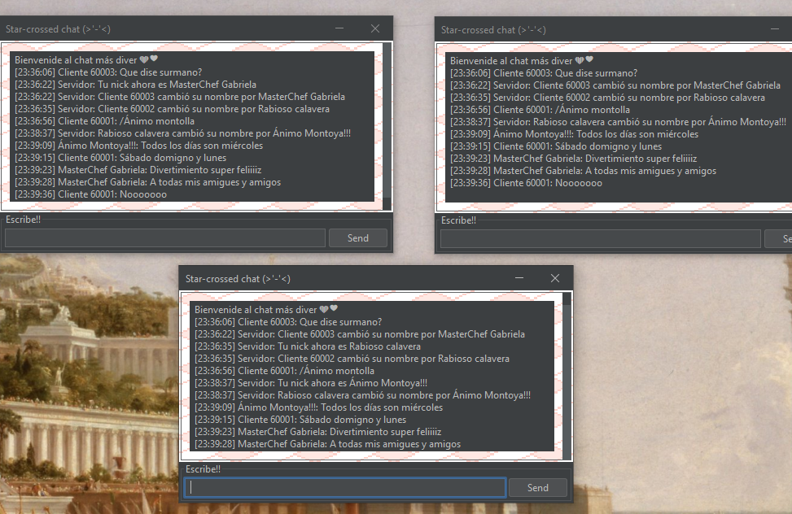

# Changelog

En este archivo comento el proceso de desarrollo.

## 2024-02-03

He programado de nuevo el chat desde cero. Ahora está un poco más 
ordenado y la UI es más bonita. Las clases antiguas siguen disponibles en el repositorio
en el paquete [`old`](Project/src/old/)

**Estado actual**

## 2024-01-24

### Añadido

- Nuevo repositorio
- Añadido Chat base realizado como tarea
- Programa **cliente**
    - Acepta entrada del usuario por teclado y simultáneamente recibe mensajes 
      del servidor
- Programa **servidor**
    - Cuando acepta la conexión de un cliente, **lanza un hilo y abre 
      un puerto** para gestionar esta nueva conexión.
    - Al recibir un mensaje de un cliente, retransmite ese mensaje a todos 
      los clientes.
    - Permite al programa cliente identificarse con un nombre
      de usuario