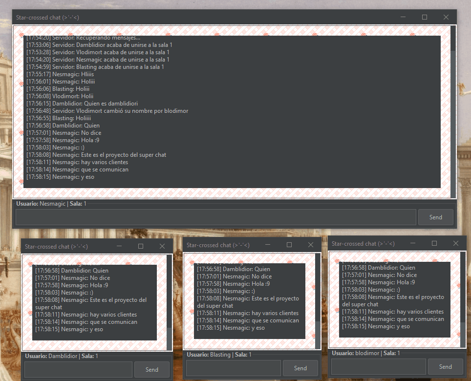

<h1 align="center"> T.I.N.A.C. </h1>

<pre align="center">
_______________________
/\                      \
\_|        TINAC        |
  |      This           |
  |      Is             |
  |      Not            |
  |      A              |
  |      Chat           |
  |                     |
    |   __________________|__
    \_/____________________/
</pre>

Un chat **cliente-servidor** desarrolado en Java utilizando `Socket` y `ServerSocket`.

No es muy útil porque solo es posible ejecutar servidor y clientes en un
mismo equipo. Con algunas modificaciones puede que funcione en red local.

## ⚙ Ejecución

### Dependencias 

Este proyecto utiliza la librería [flatlaf-3.3](https://mvnrepository.com/artifact/com.formdev/flatlaf)
para mejorar el aspecto de la interfaz gráfica.

### Desde IntelliJ IDEA

Es el IDE que estoy utilizando para desarrollar el proyecto. 

- **Permitir la ejecución de multiples instancias de Cliente**
    1. Ir a la clase **Cliente**
    2. Arriba a la derecha, elegir clase `Client` e ir a `Edit Configurations`
    3. `Build and run -> Modify options -> Allow multiple instances`

> [!NOTE]
> El código fuente ha sido comentado para facilitar la corrección

## ✨ Funcionalidades

### Básico

- Chat **cliente-servidor**
- Implementación de **salas**
- Identificación del **cliente**

### Avanzado

- Interfaz gráfica en **Java Swing**
- El cliente puede envíar y recibir mensajes **simultáneamente**
- Los **mensajes se almacenan** en memoria, cuando se une un nuevo cliente, se **recuperan** estos mensajes.
- Los mensajes se almacenan **encriptados** en un **fichero**
- Los usuarios eligen **nombre** y **sala** antes de entrar al chat

#### Sistema de **Comandos**

```
/help     Muestra los comandos
/quit     Sale del chat
/nick     Muestra el nick actual/cambia el nick
/room     Muestra sala actual/cambia de sala
/users    Muestra los usuarios conectados
/rooms    Muestra las salas activas
/netinfo  Muestra información acerca de la conexión
```

### Posibles mejoras

- Adaptar el código para que funcione en red local
- En la interfaz gráfica, mostrar a un lado las salas activas

## 📚 Recursos utilizados

El proyecto parte de los apuntes de clase acerca de programación de comunicaciones en red, 
también he utilizado el código proporcionado en **Acceso a datos** para la encriptación de mensajes.
Esta [pregunta](https://stackoverflow.com/questions/434718/sockets-discover-port-availability-using-java) me ha
servido de ayuda para comprobar que puertos están disponibles.

También he buscado en internet para la parte de **Java-Swing**, aunque no he guardado las fuentes.
No he utilizado IAs.

## 🎥

<div align="center">



</div>

---

```yaml
Módulo: Programación de Servicios y Procesos
Lenguaje: Java
Tema: UT3: Programación de Comunicaciones en Red
Herramientas: 
  - IntelliJ Idea CE 2023.2.2
  - JDK 21
Fecha: 2024-02-15
```